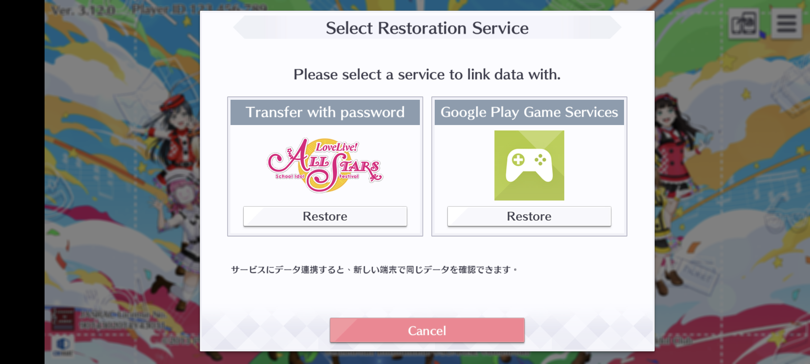
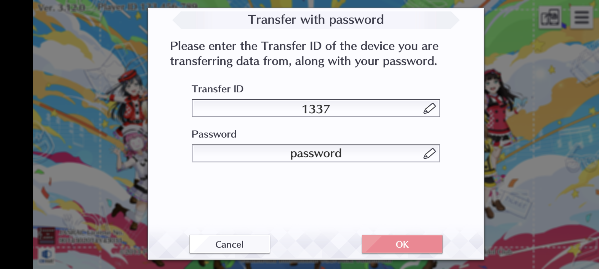

# Account system
Elichika actually support multiple accounts. This is the document for it, if you have a server with multiple people or just have multiple accounts for some reasons.

## Account transfer
You can use the account transfer system to switch / create account. Select ``transfer with password``. 

Enter your user / player id and a password:

- UserId is an non-negative integer with at most 9 digits.
- If user is in the database, password will be checked against the stored password.
- Otherwise a new account with that player id and password.
    - You can also leave the password empty.
    - If you are not running the server yourself, it's highly recommended that you setup a password, because other user can take over your account if they know your user id.
    - Passwords are securely stored with bcrypt.

After that, confirm the transfer and you can login with the new user id.

At any point, you can use the transfer id system inside the game to change your password.

## Multi devices
You can use multiple devices to play the game from one server, if you have set things up correctly.

Playing the game on another device while the current one is running will cause the current one to disconnect, preventing any error being done to your user data.

Note that this only apply to an external server, not the embedded one or the one run inside termux.

## Note about client languages
You can use both the Japanese and Global client for the same server (and the same database).

However, it's recommended to not play one account (user id) in both Japanese and Global client, because some contents are exclusive to only 1 server, and will cause the client to freeze.

