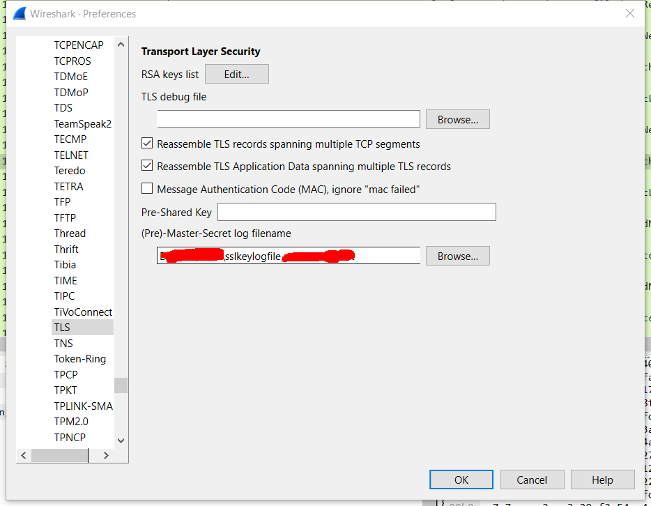
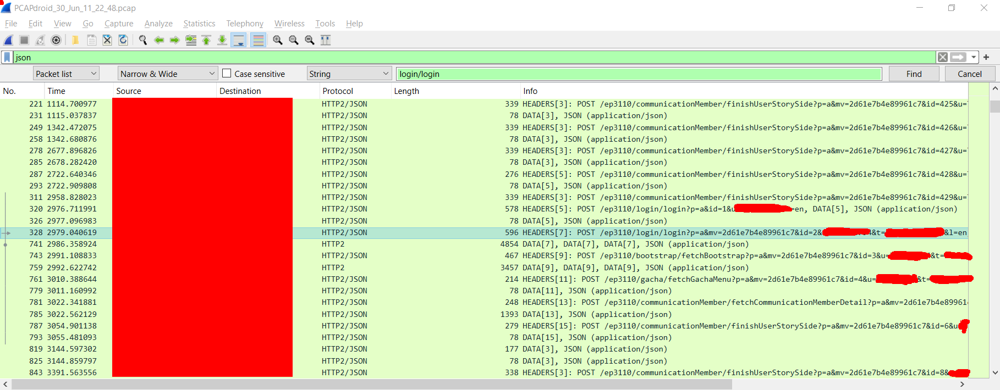
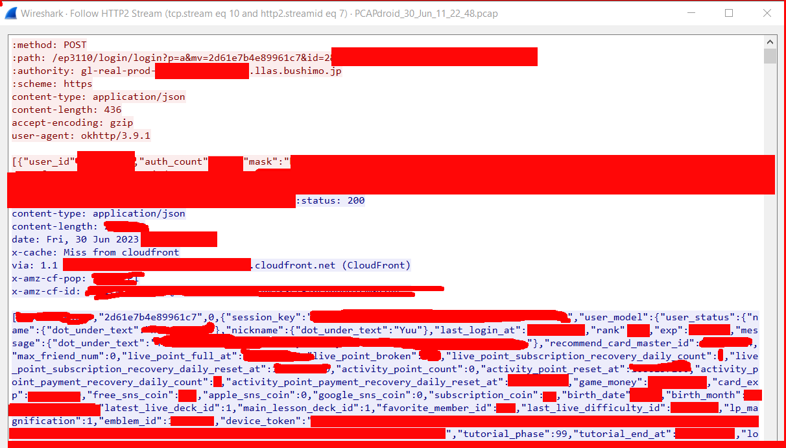

# Extracting gamedata from pcap

*This is considered [advanced usage](https://github.com/arina999999997/elichika/blob/master/docs/advanced_usage.md): you should know what pcap is and you need to have a generated pcap from before EOS to do this with.*

This guide assume that you used PcapDroid to capture the network data. If you have used something else, it will be mostly applicable.

Assuming that you have correctly captured the network data, you will have the 2 files:

- `PCAPdroid_<day>_<Month>_<hour>_<minute>_<second>.pcap`
- And `sslkeylog.txt` (or some similar name).

THe PCAPdroid file is the raw data, the `sslkeylog.txt` file contain the key to decrypt the network data. FYI, it should looks something like the following:

```
CLIENT_RANDOM <some_data> <some_other_data>
CLIENT_RANDOM <some_other_other_data> <some_other_other_other_data>
....
```

If you haven't got both files then this won't work. If you have got only the `.pcap`, then in theory you can crack the code, but cracking the code would take so long that you might as well reconstruct your account from scratch.

## Installing wireshark

There are multiple way to read captured network data, but the most common way is to use wireshark. You can download it [here](https://www.wireshark.org/download.html).

Note that you will need to have a PC with Windows or MacOs, or you can try emulation / build from source if you have linux. In the case that you don't have access to a PC, you can get a trusted friend to do the extraction for you. Do note that the data will contain a lot of things with regard to your account, including your sif2 transfer password, so only ask trusted friend to do it.
## Reading the network data
Once you have installed wireshark, open it up.

First you will need to give wireshark the relevant key:
- Select Edit -> Preferences (Ctrl + Shift + P on windows).
- On the left, select Protocols, expands it, then scroll down to TLS. You will see the following menu:

- Select your `sslkeylog.txt` file for the Master-Secret log filename field.

Then you can open the `.pcap` file, just select File -> Open (Ctrl + O on windows) and select the file. If you have done things correctly, you will see something similar to this:


Click on the `Apply a display filter` bar and type json. This will filter the network so only json traffic show up, which is the game data we're interested in.

## Extracting login data

With the file opened and the display filter on, select Edit -> Find Packet (Ctrl + F on windows). This will pop out a find bar. You should select `Packet list`, `Narrow & Wide`, uncheck `Case sensitive` select `String` and type in `login/login`, like this image:


If your network data has a login data, the program will select and highlight a packet that has the login data, like so:


Note that if you login for the first time on a device, you might get 2 `login/login` request like I did in the image. You should ignore the one with lower length as that one don't contain relevant data.

Select the packet right after the highlighted login one (in the above image it would be the one with length 4854). You should then right click it and select Follow->HTTP/2 stream. A new window will pop up to show you the data, hopefully it will look something like this:



Now on the bottom left side, click on entire conversation and choose whichever is larger. You know you gave the correct option when the only displayed text are blues. Then on the bottom mid, click save as and save the file. Let's say we save it as `login.json`.

We still need to modify the file a bit, so open up the file with some text editor that can handle the big file like Notepad or Notepad++.

You should then delete the first block of text, so from `status: 200` to the end of the `x-amz`... line. Yours might be different, but just remove everything from the beginning to the first empty line.

Then you should remove the beginning until the `{"session_key:"` part. For example, my data was:
```
[16xxxxxxxxxxx,"2d61e7b4e89961c7",0,{"session_key":...
```

So I removed the `[16xxxxxxxxxxx,"2d61e7b4e89961c7",0,` part, leaving:
```
{"session_key":...
```
Similarly go to the end of the file, you will find something like:
```
..."check_maintenance":true,"repro_info":{"group_no":1}},"somerandomhexstring"]
```
Remove the last part to get
```
..."check_maintenance":true,"repro_info":{"group_no":1}}
```
and save the file. Now you should have a correct `login.json` file that can be used in account importing.

